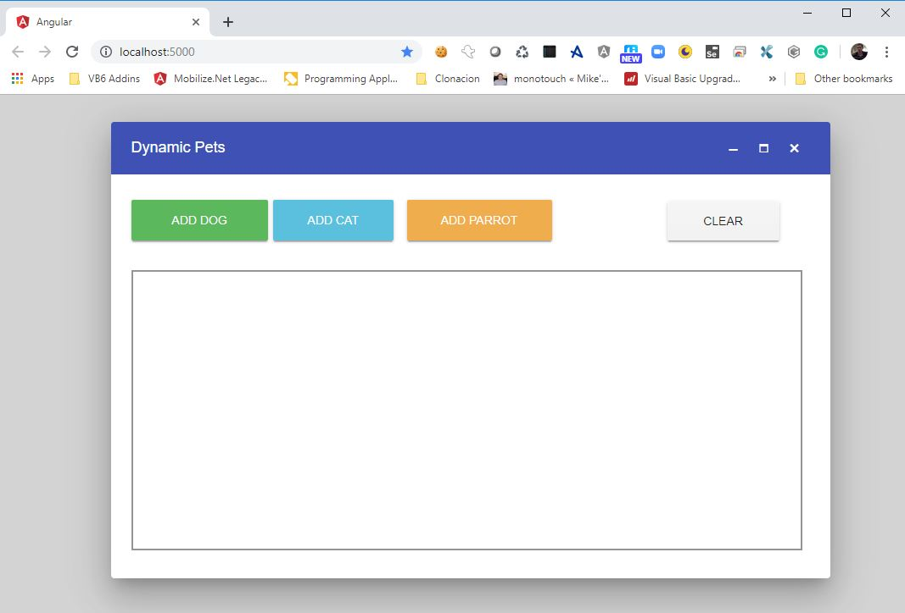
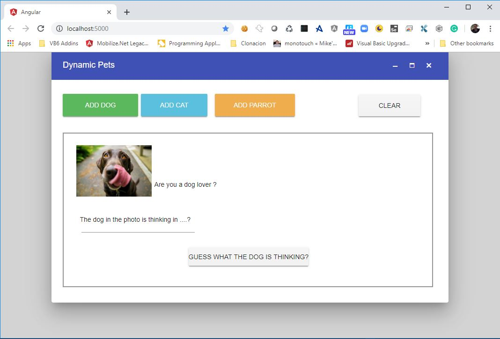
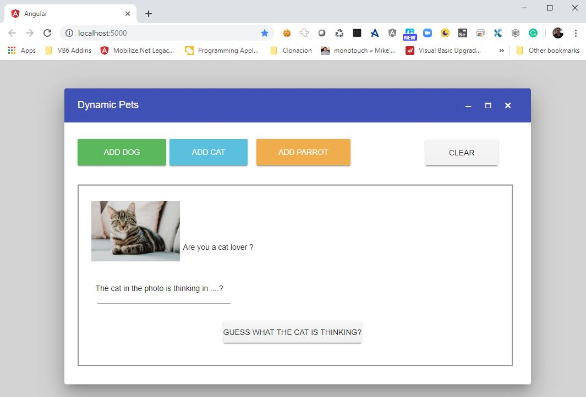
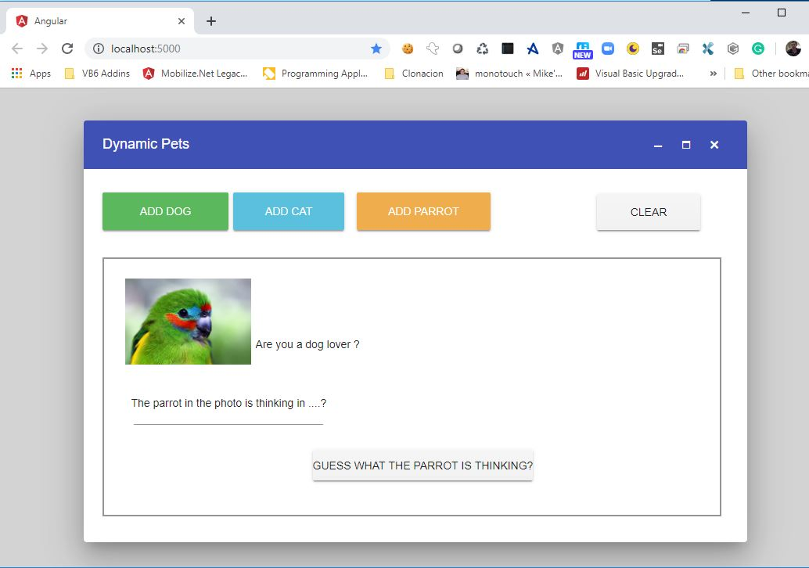

# Dynamic Pets

One common question people has for WebMap is:

> Does it support dynamic components?

And the answer is yes it does.

**Dynamic Pets** is a small sample to show how WebMap handles dynamic components. 

You can find the [WinForms source code here](https://github.com/MobilizeNet/DynamicPets)

The main screen is as follows:

You can add a dog by pressing the green button:

Press clear and now you can add a cat by pressing the light blue button:

Press clear and now you can add a parrot by pressing the orange button:

If you do not want to waste a lot of time setting up an environment, you can open this application on [Gitpod](https://gitpod.io).

[Gitpod](https://gitpod.io) is a great company that allows you to get your repo up and runnning hosted on a cloud IDE.

This is cloud environment that shows how this migrated application can be taken all the way from VB6 to a dockerized Linux container :)

# Photos
The images were downloaded [Unsplash](https://unsplash.com)
Bird Photo by David Clode on [Unsplash](https://unsplash.com)
Cat  Photo by Erik-Jan Leusink on [Unsplash](https://unsplash.com)
Dog  Photo by James Barker on [Unsplash](https://unsplash.com)